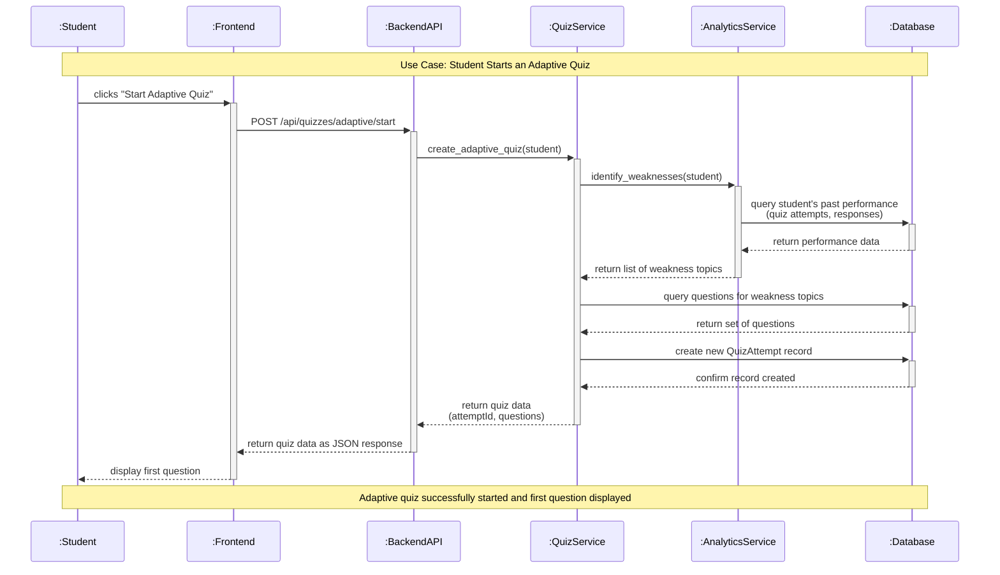

# AI-Powered Personalized Learning System
## Sequence Diagram: Student Starts an Adaptive Quiz

```mermaid
sequenceDiagram
    participant Student as :Student
    participant Frontend as :Frontend
    participant BackendAPI as :BackendAPI
    participant QuizService as :QuizService
    participant AnalyticsService as :AnalyticsService
    participant Database as :Database

    Note over Student, Database: Use Case: Student Starts an Adaptive Quiz

    %% Step 1: Student initiates quiz
    Student->>+Frontend: clicks "Start Adaptive Quiz"
    
    %% Step 2: Frontend calls backend
    Frontend->>+BackendAPI: POST /api/quizzes/adaptive/start
    
    %% Step 3: Backend calls quiz service
    BackendAPI->>+QuizService: create_adaptive_quiz(student)
    
    %% Step 4: Quiz service calls analytics
    QuizService->>+AnalyticsService: identify_weaknesses(student)
    
    %% Step 5: Analytics queries database for performance
    AnalyticsService->>+Database: query student's past performance<br/>(quiz attempts, responses)
    
    %% Step 6: Database returns performance data
    Database-->>-AnalyticsService: return performance data
    
    %% Step 7: Analytics processes and returns weaknesses
    AnalyticsService-->>-QuizService: return list of weakness topics
    
    %% Step 8: Quiz service queries for questions
    QuizService->>+Database: query questions for weakness topics
    
    %% Step 9: Database returns questions
    Database-->>-QuizService: return set of questions
    
    %% Step 10: Quiz service creates attempt record
    QuizService->>+Database: create new QuizAttempt record
    Database-->>-QuizService: confirm record created
    
    %% Step 11: Quiz service returns data to backend
    QuizService-->>-BackendAPI: return quiz data<br/>(attemptId, questions)
    
    %% Step 12: Backend returns JSON response
    BackendAPI-->>-Frontend: return quiz data as JSON response
    
    %% Step 13: Frontend displays question
    Frontend-->>-Student: display first question

    Note over Student, Database: Adaptive quiz successfully started and first question displayed
```