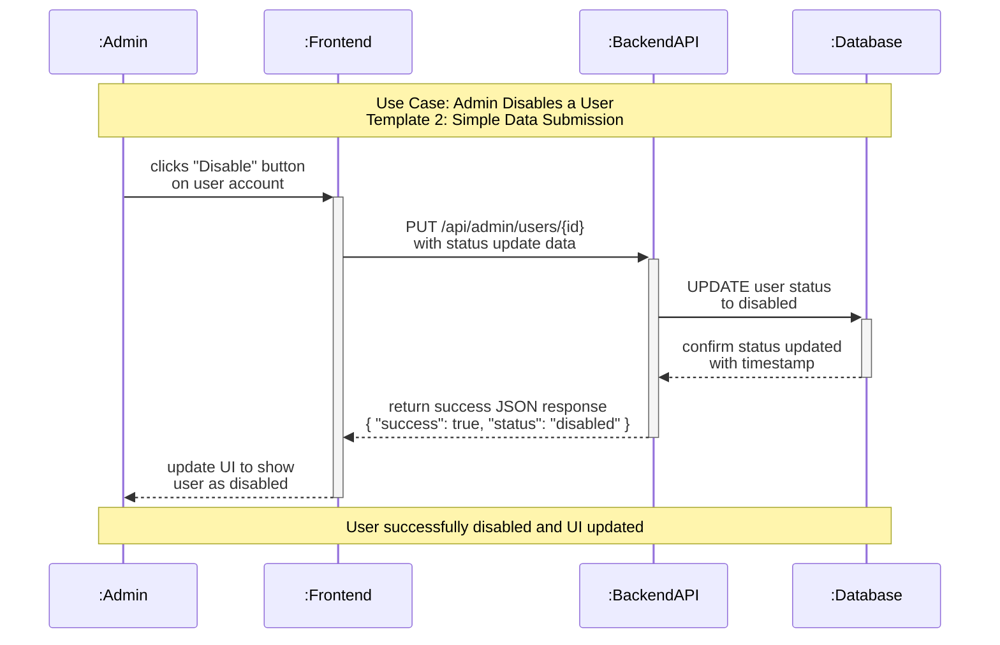

# AI-Powered Personalized Learning System
## Sequence Diagram: Admin Disables a User

```mermaid
sequenceDiagram
    participant Admin as :Admin
    participant Frontend as :Frontend
    participant BackendAPI as :BackendAPI
    participant Database as :Database

    Note over Admin, Database: Use Case: Admin Disables a User<br/>Template 2: Simple Data Submission

    %% Step 1: Admin clicks disable button
    Admin->>+Frontend: clicks "Disable" button<br/>on user account
    
    %% Step 2: Frontend sends disable request
    Frontend->>+BackendAPI: PUT /api/admin/users/{id}<br/>with status update data
    
    %% Step 3: Backend updates user status
    BackendAPI->>+Database: UPDATE user status<br/>to disabled
    
    %% Step 4: Database confirms update
    Database-->>-BackendAPI: confirm status updated<br/>with timestamp
    
    %% Step 5: Backend returns success response
    BackendAPI-->>-Frontend: return success JSON response<br/>{ "success": true, "status": "disabled" }
    
    %% Step 6: Frontend updates UI
    Frontend-->>-Admin: update UI to show<br/>user as disabled

    Note over Admin, Database: User successfully disabled and UI updated
```