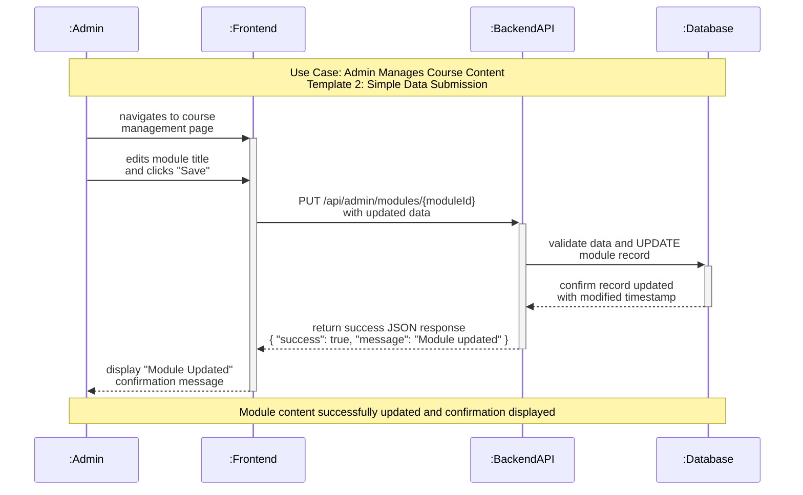

# AI-Powered Personalized Learning System
## Sequence Diagram: Admin Manages Course Content

```mermaid
sequenceDiagram
    participant Admin as :Admin
    participant Frontend as :Frontend
    participant BackendAPI as :BackendAPI
    participant Database as :Database

    Note over Admin, Database: Use Case: Admin Manages Course Content<br/>Template 2: Simple Data Submission

    %% Step 1: Admin navigates to course management
    Admin->>+Frontend: navigates to course<br/>management page
    
    %% Step 2: Admin edits and saves module
    Admin->>Frontend: edits module title<br/>and clicks "Save"
    
    %% Step 3: Frontend sends update request
    Frontend->>+BackendAPI: PUT /api/admin/modules/{moduleId}<br/>with updated data
    
    %% Step 4: Backend validates and updates module
    BackendAPI->>+Database: validate data and UPDATE<br/>module record
    
    %% Step 5: Database confirms update
    Database-->>-BackendAPI: confirm record updated<br/>with modified timestamp
    
    %% Step 6: Backend returns success response
    BackendAPI-->>-Frontend: return success JSON response<br/>{ "success": true, "message": "Module updated" }
    
    %% Step 7: Frontend displays confirmation
    Frontend-->>-Admin: display "Module Updated"<br/>confirmation message

    Note over Admin, Database: Module content successfully updated and confirmation displayed
```