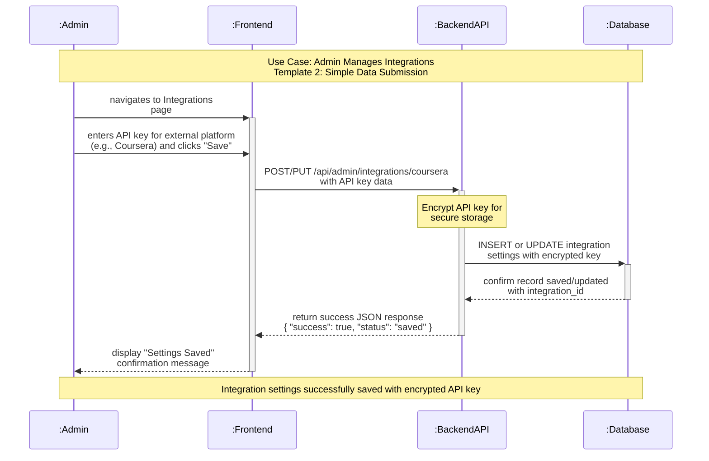

# AI-Powered Personalized Learning System
## Sequence Diagram: Admin Manages Integrations

```mermaid
sequenceDiagram
    participant Admin as :Admin
    participant Frontend as :Frontend
    participant BackendAPI as :BackendAPI
    participant Database as :Database

    Note over Admin, Database: Use Case: Admin Manages Integrations<br/>Template 2: Simple Data Submission

    %% Step 1: Admin navigates to integrations page
    Admin->>+Frontend: navigates to Integrations<br/>page
    
    %% Step 2: Admin enters API key and saves
    Admin->>Frontend: enters API key for external platform<br/>(e.g., Coursera) and clicks "Save"
    
    %% Step 3: Frontend sends integration request
    Frontend->>+BackendAPI: POST/PUT /api/admin/integrations/coursera<br/>with API key data
    
    %% Step 4: Backend encrypts API key
    Note over BackendAPI: Encrypt API key for<br/>secure storage
    
    %% Step 5: Backend stores integration settings
    BackendAPI->>+Database: INSERT or UPDATE integration<br/>settings with encrypted key
    
    %% Step 6: Database confirms save/update
    Database-->>-BackendAPI: confirm record saved/updated<br/>with integration_id
    
    %% Step 7: Backend returns success response
    BackendAPI-->>-Frontend: return success JSON response<br/>{ "success": true, "status": "saved" }
    
    %% Step 8: Frontend displays confirmation
    Frontend-->>-Admin: display "Settings Saved"<br/>confirmation message

    Note over Admin, Database: Integration settings successfully saved with encrypted API key
```