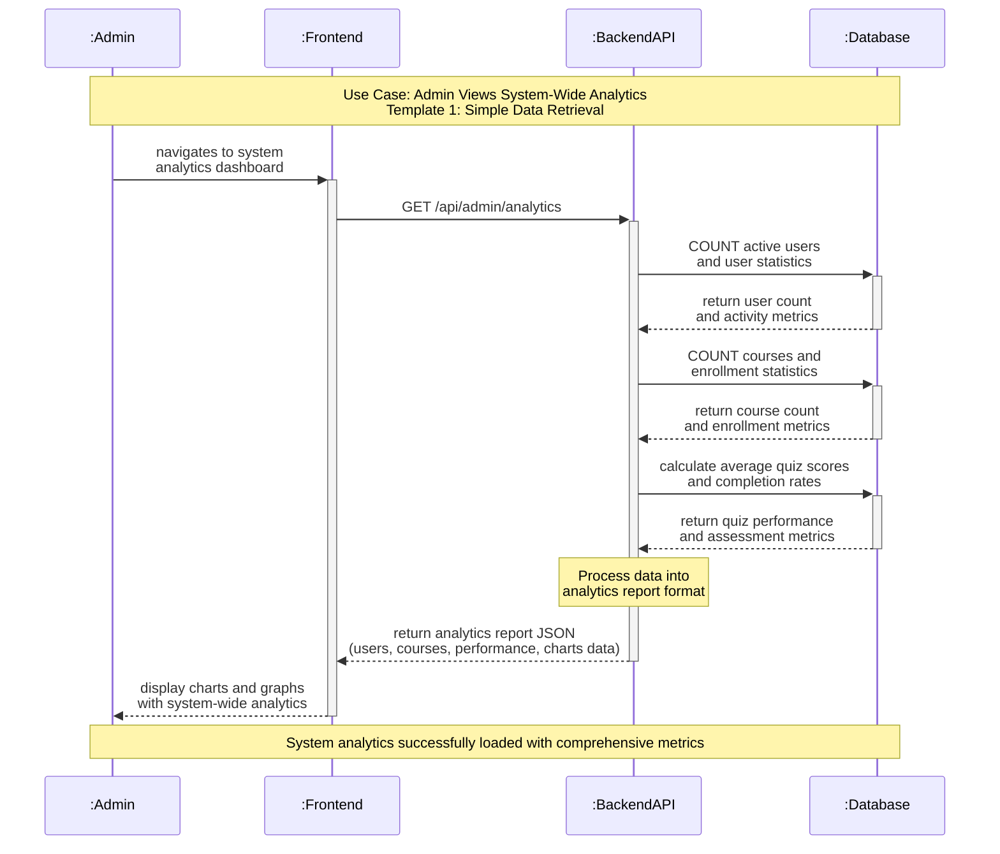

# AI-Powered Personalized Learning System
## Sequence Diagram: Admin Views System-Wide Analytics

```mermaid
sequenceDiagram
    participant Admin as :Admin
    participant Frontend as :Frontend
    participant BackendAPI as :BackendAPI
    participant Database as :Database

    Note over Admin, Database: Use Case: Admin Views System-Wide Analytics<br/>Template 1: Simple Data Retrieval

    %% Step 1: Admin navigates to analytics dashboard
    Admin->>+Frontend: navigates to system<br/>analytics dashboard
    
    %% Step 2: Frontend requests analytics data
    Frontend->>+BackendAPI: GET /api/admin/analytics
    
    %% Step 3: Backend queries for active users count
    BackendAPI->>+Database: COUNT active users<br/>and user statistics
    
    %% Step 4: Database returns user data
    Database-->>-BackendAPI: return user count<br/>and activity metrics
    
    %% Step 5: Backend queries for course statistics
    BackendAPI->>+Database: COUNT courses and<br/>enrollment statistics
    
    %% Step 6: Database returns course data
    Database-->>-BackendAPI: return course count<br/>and enrollment metrics
    
    %% Step 7: Backend queries for quiz performance
    BackendAPI->>+Database: calculate average quiz scores<br/>and completion rates
    
    %% Step 8: Database returns quiz analytics
    Database-->>-BackendAPI: return quiz performance<br/>and assessment metrics
    
    %% Step 9: Backend processes and returns report
    Note over BackendAPI: Process data into<br/>analytics report format
    BackendAPI-->>-Frontend: return analytics report JSON<br/>(users, courses, performance, charts data)
    
    %% Step 10: Frontend displays analytics
    Frontend-->>-Admin: display charts and graphs<br/>with system-wide analytics

    Note over Admin, Database: System analytics successfully loaded with comprehensive metrics
```