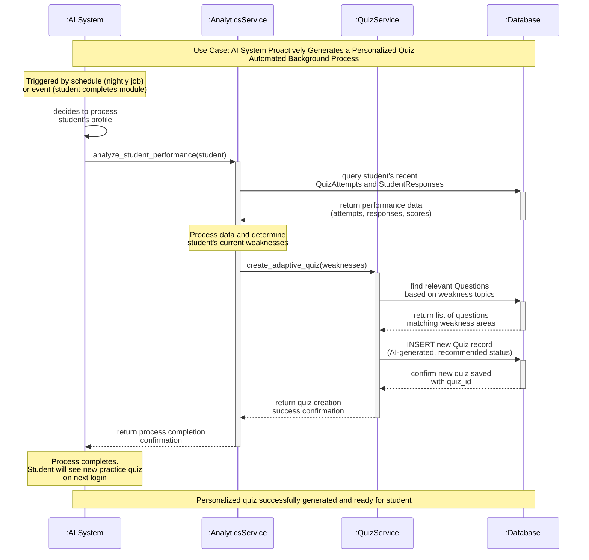

# AI-Powered Personalized Learning System
## Sequence Diagram: AI System Proactively Generates a Personalized Quiz

```mermaid
sequenceDiagram
    participant AISystem as :AI System
    participant AnalyticsService as :AnalyticsService
    participant QuizService as :QuizService
    participant Database as :Database

    Note over AISystem, Database: Use Case: AI System Proactively Generates a Personalized Quiz<br/>Automated Background Process

    %% Step 1: AI System is triggered
    Note over AISystem: Triggered by schedule (nightly job)<br/>or event (student completes module)
    AISystem->>AISystem: decides to process<br/>student's profile
    
    %% Step 2: AI System calls analytics
    AISystem->>+AnalyticsService: analyze_student_performance(student)
    
    %% Step 3: Analytics queries for performance data
    AnalyticsService->>+Database: query student's recent<br/>QuizAttempts and StudentResponses
    
    %% Step 4: Database returns performance data
    Database-->>-AnalyticsService: return performance data<br/>(attempts, responses, scores)
    
    %% Step 5: Analytics processes and calls quiz service
    Note over AnalyticsService: Process data and determine<br/>student's current weaknesses
    AnalyticsService->>+QuizService: create_adaptive_quiz(weaknesses)
    
    %% Step 6: Quiz service queries for questions
    QuizService->>+Database: find relevant Questions<br/>based on weakness topics
    
    %% Step 7: Database returns questions
    Database-->>-QuizService: return list of questions<br/>matching weakness areas
    
    %% Step 8: Quiz service creates new quiz
    QuizService->>+Database: INSERT new Quiz record<br/>(AI-generated, recommended status)
    
    %% Step 9: Database confirms quiz creation
    Database-->>-QuizService: confirm new quiz saved<br/>with quiz_id
    
    %% Step 10: Quiz service returns success
    QuizService-->>-AnalyticsService: return quiz creation<br/>success confirmation
    
    %% Step 11: Analytics returns to AI System
    AnalyticsService-->>-AISystem: return process completion<br/>confirmation
    
    %% Step 12: Process completes
    Note over AISystem: Process completes.<br/>Student will see new practice quiz<br/>on next login

    Note over AISystem, Database: Personalized quiz successfully generated and ready for student
```