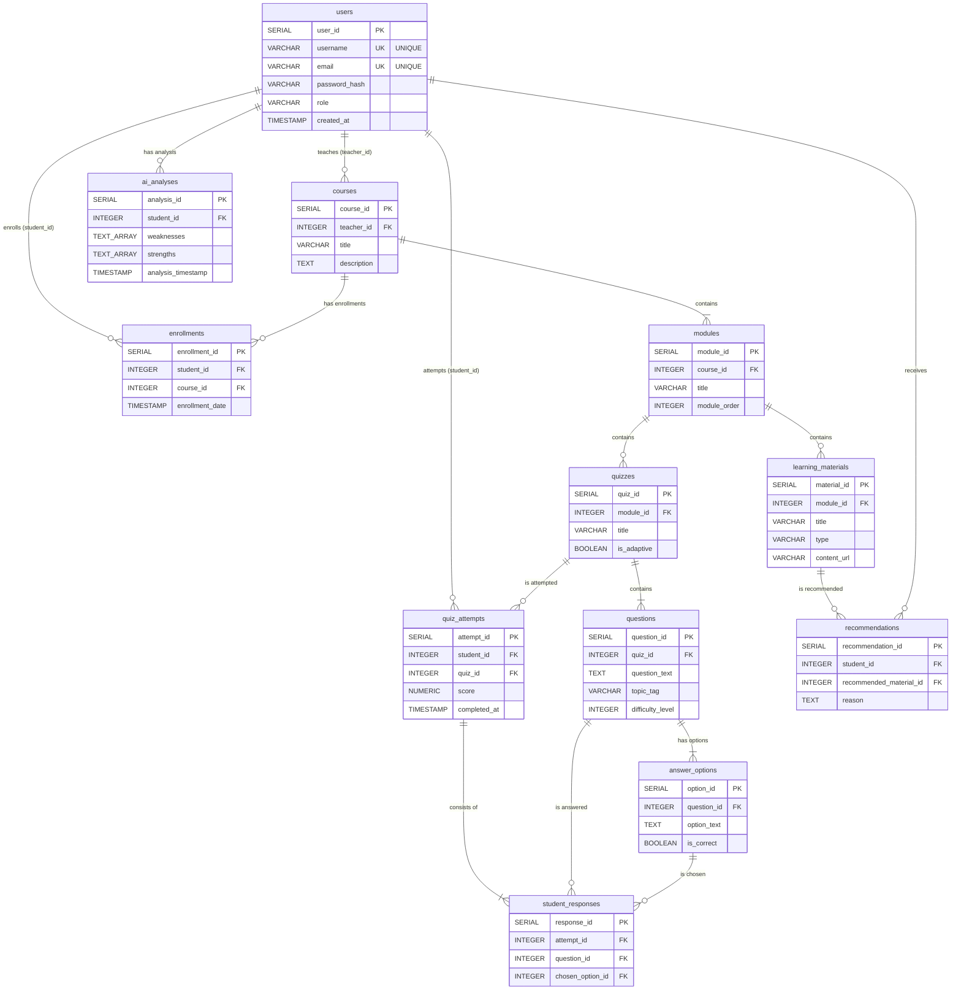

# AI-Powered Personalized Learning System - Database Schema Diagram

## Schema Overview

This diagram represents the complete database schema for an AI-Powered Personalized Learning System with the following key components:

### Core Entities
- **users**: System users (students and teachers)
- **courses**: Learning courses created by teachers
- **modules**: Course content organized into modules
- **learning_materials**: Educational resources within modules

### Assessment System
- **quizzes**: Assessments within modules (can be adaptive)
- **questions**: Individual quiz questions with difficulty levels
- **answer_options**: Multiple choice options for questions

### Learning Analytics
- **enrollments**: Student course registrations
- **quiz_attempts**: Student quiz completion records
- **student_responses**: Individual question responses
- **ai_analyses**: AI-generated student performance analysis
- **recommendations**: AI-powered learning material suggestions

### Key Features
- **Adaptive Learning**: Quiz adaptability based on student performance
- **AI Integration**: Automated analysis of student weaknesses/strengths
- **Personalized Recommendations**: AI-driven content suggestions
- **Comprehensive Tracking**: Full audit trail of student interactions
- **Role-based Access**: Support for different user roles (students/teachers)