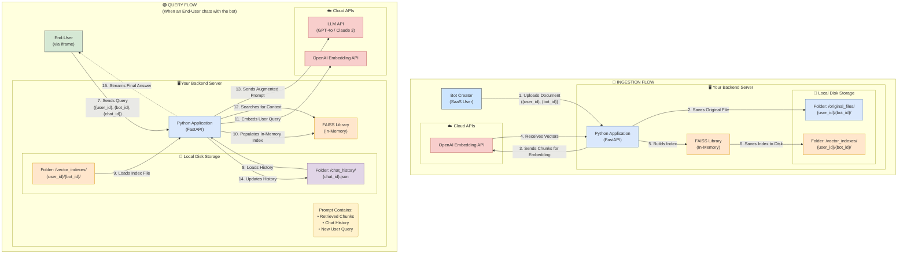

# RAG System Architecture Diagram (Corrected)

```mermaid
graph TD
    %% Styling Definitions
    classDef actorStyle fill:#cce5ff,stroke:#36393d
    classDef actorStyle2 fill:#d5e8d4,stroke:#36393d
    classDef appStyle fill:#dae8fc,stroke:#6c8ebf
    classDef faissStyle fill:#ffe6cc,stroke:#d79b00
    classDef folderStyle fill:#dae8fc,stroke:#6c8ebf
    classDef folderStyle2 fill:#ffe6cc,stroke:#d79b00
    classDef folderStyle3 fill:#e1d5e7,stroke:#9673a6
    classDef noteStyle fill:#fff2cc,stroke:#d6b656
    classDef apiStyle fill:#f8cecc,stroke:#b85450

    %% Column 1: INGESTION FLOW
    subgraph IngestionFlow ["🔵 INGESTION FLOW<br/>(When a Bot Creator uploads a document)"]
        %% Actor
        BC["Bot Creator<br/>(SaaS User)"]
        
        %% Backend Server Swimlane
        subgraph BackendServer1 ["🖥️ Your Backend Server"]
            App1["Python Application<br/>(FastAPI)"]
            FAISS1["FAISS Library<br/>(In-Memory)"]
            
            %% Local Disk Storage Sub-swimlane
            subgraph LocalStorage1 ["💾 Local Disk Storage"]
                Folder1["Folder: /original_files/<br/>{user_id}/{bot_id}/"]
                Folder2["Folder: /vector_indexes/<br/>{user_id}/{bot_id}/"]
            end
        end
        
        %% Cloud APIs Swimlane
        subgraph CloudAPIs1 ["☁️ Cloud APIs"]
            Embed1["OpenAI Embedding API"]
        end
    end
    
    %% Column 2: QUERY FLOW
    subgraph QueryFlow ["🟢 QUERY FLOW<br/>(When an End-User chats with the bot)"]
        %% Actor
        EU["End-User<br/>(via Iframe)"]
        
        %% Backend Server Swimlane
        subgraph BackendServer2 ["🖥️ Your Backend Server"]
            App2["Python Application<br/>(FastAPI)"]
            FAISS2["FAISS Library<br/>(In-Memory)"]
            
            %% Local Disk Storage Sub-swimlane
            subgraph LocalStorage2 ["💾 Local Disk Storage"]
                Folder3["Folder: /vector_indexes/<br/>{user_id}/{bot_id}/"]
                Folder4["Folder: /chat_history/<br/>{chat_id}.json"]
            end
            
            %% Prompt Note
            Note1("Prompt Contains:<br/>• Retrieved Chunks<br/>• Chat History<br/>• New User Query")
        end
        
        %% Cloud APIs Swimlane
        subgraph CloudAPIs2 ["☁️ Cloud APIs"]
            Embed2["OpenAI Embedding API"]
            LLM1["LLM API<br/>(GPT-4o / Claude 3)"]
        end
    end
    
    %% INGESTION FLOW ARROWS (Steps 1-6)
    BC --"1. Uploads Document<br/>({user_id}, {bot_id})"--> App1
    App1 --"2. Saves Original File"--> Folder1
    App1 --"3. Sends Chunks for Embedding"--> Embed1
    Embed1 --"4. Receives Vectors"--> App1
    App1 --"5. Builds Index"--> FAISS1
    FAISS1 --"6. Saves Index to Disk"--> Folder2
    
    %% QUERY FLOW ARROWS (Steps 7-15)
    EU --"7. Sends Query<br/>({user_id}, {bot_id}, {chat_id})"--> App2
    Folder4 --"8. Loads History"--> App2
    Folder3 --"9. Loads Index File"--> App2
    App2 --"10. Populates In-Memory Index"--> FAISS2
    App2 --"11. Embeds User Query"--> Embed2
    App2 --"12. Searches for Context"--> FAISS2
    App2 --"13. Sends Augmented Prompt"--> LLM1
    App2 --"14. Updates History"--> Folder4
    App2 -.->|"15. Streams Final Answer"| EU
    
    %% Apply Styles
    class BC actorStyle
    class EU actorStyle2
    class App1,App2 appStyle
    class FAISS1,FAISS2 faissStyle
    class Folder1 folderStyle
    class Folder2,Folder3 folderStyle2
    class Folder4 folderStyle3
    class Note1 noteStyle
    class Embed1,Embed2,LLM1 apiStyle
```