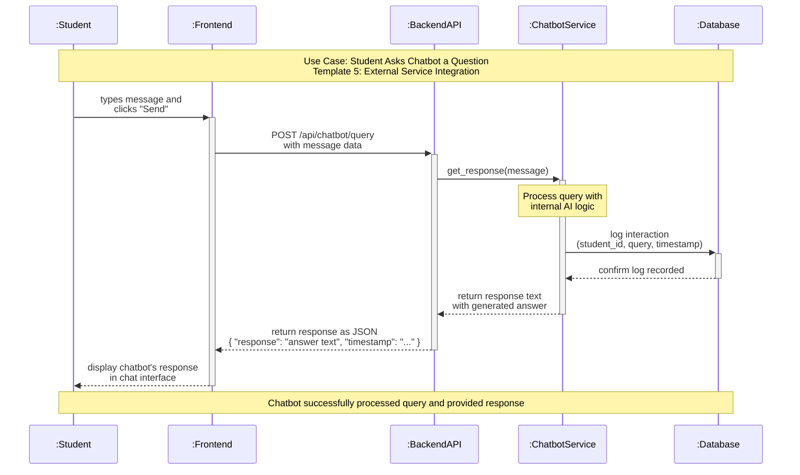

# AI-Powered Personalized Learning System
## Sequence Diagram: Student Asks Chatbot a Question

```mermaid
sequenceDiagram
    participant Student as :Student
    participant Frontend as :Frontend
    participant BackendAPI as :BackendAPI
    participant ChatbotService as :ChatbotService
    participant Database as :Database

    Note over Student, Database: Use Case: Student Asks Chatbot a Question<br/>Template 5: External Service Integration

    %% Step 1: Student sends message
    Student->>+Frontend: types message and<br/>clicks "Send"
    
    %% Step 2: Frontend sends query request
    Frontend->>+BackendAPI: POST /api/chatbot/query<br/>with message data
    
    %% Step 3: Backend calls chatbot service
    BackendAPI->>+ChatbotService: get_response(message)
    
    %% Step 4: Chatbot processes query
    Note over ChatbotService: Process query with<br/>internal AI logic
    
    %% Step 5: Chatbot logs interaction
    ChatbotService->>+Database: log interaction<br/>(student_id, query, timestamp)
    Database-->>-ChatbotService: confirm log recorded
    
    %% Step 6: Chatbot returns response
    ChatbotService-->>-BackendAPI: return response text<br/>with generated answer
    
    %% Step 7: Backend returns JSON response
    BackendAPI-->>-Frontend: return response as JSON<br/>{ "response": "answer text", "timestamp": "..." }
    
    %% Step 8: Frontend displays response
    Frontend-->>-Student: display chatbot's response<br/>in chat interface

    Note over Student, Database: Chatbot successfully processed query and provided response
```