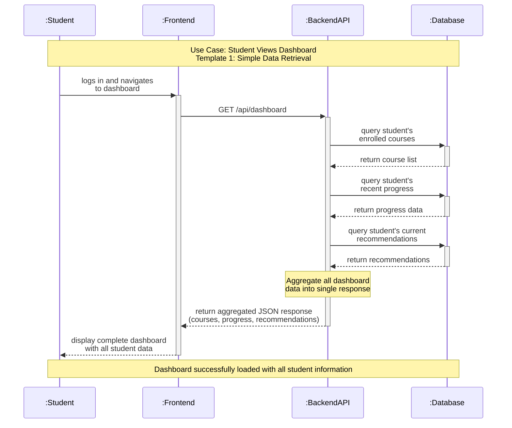

# AI-Powered Personalized Learning System
## Sequence Diagram: Student Views Dashboard

```mermaid
sequenceDiagram
    participant Student as :Student
    participant Frontend as :Frontend
    participant BackendAPI as :BackendAPI
    participant Database as :Database

    Note over Student, Database: Use Case: Student Views Dashboard<br/>Template 1: Simple Data Retrieval

    %% Step 1: Student navigates to dashboard
    Student->>+Frontend: logs in and navigates<br/>to dashboard
    
    %% Step 2: Frontend requests dashboard data
    Frontend->>+BackendAPI: GET /api/dashboard
    
    %% Step 3: Backend queries for enrolled courses
    BackendAPI->>+Database: query student's<br/>enrolled courses
    
    %% Step 4: Database returns course list
    Database-->>-BackendAPI: return course list
    
    %% Step 5: Backend queries for progress data
    BackendAPI->>+Database: query student's<br/>recent progress
    
    %% Step 6: Database returns progress data
    Database-->>-BackendAPI: return progress data
    
    %% Step 7: Backend queries for recommendations
    BackendAPI->>+Database: query student's current<br/>recommendations
    
    %% Step 8: Database returns recommendations
    Database-->>-BackendAPI: return recommendations
    
    %% Step 9: Backend aggregates and returns data
    Note over BackendAPI: Aggregate all dashboard<br/>data into single response
    BackendAPI-->>-Frontend: return aggregated JSON response<br/>(courses, progress, recommendations)
    
    %% Step 10: Frontend displays dashboard
    Frontend-->>-Student: display complete dashboard<br/>with all student data

    Note over Student, Database: Dashboard successfully loaded with all student information
```