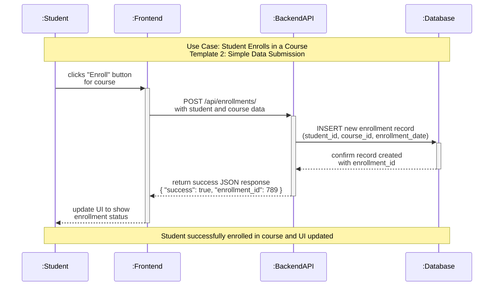

# AI-Powered Personalized Learning System
## Sequence Diagram: Student Enrolls in a Course

```mermaid
sequenceDiagram
    participant Student as :Student
    participant Frontend as :Frontend
    participant BackendAPI as :BackendAPI
    participant Database as :Database

    Note over Student, Database: Use Case: Student Enrolls in a Course<br/>Template 2: Simple Data Submission

    %% Step 1: Student clicks enroll button
    Student->>+Frontend: clicks "Enroll" button<br/>for course
    
    %% Step 2: Frontend sends enrollment request
    Frontend->>+BackendAPI: POST /api/enrollments/<br/>with student and course data
    
    %% Step 3: Backend creates enrollment record
    BackendAPI->>+Database: INSERT new enrollment record<br/>(student_id, course_id, enrollment_date)
    
    %% Step 4: Database confirms creation
    Database-->>-BackendAPI: confirm record created<br/>with enrollment_id
    
    %% Step 5: Backend returns success response
    BackendAPI-->>-Frontend: return success JSON response<br/>{ "success": true, "enrollment_id": 789 }
    
    %% Step 6: Frontend updates UI
    Frontend-->>-Student: update UI to show<br/>enrollment status

    Note over Student, Database: Student successfully enrolled in course and UI updated
```