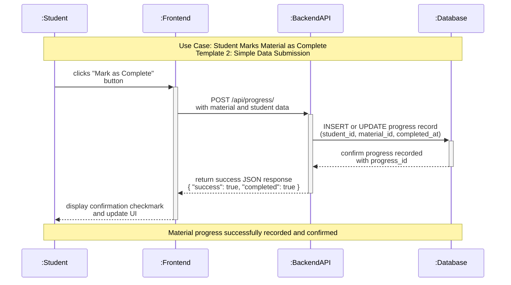

# AI-Powered Personalized Learning System
## Sequence Diagram: Student Marks Material as Complete

```mermaid
sequenceDiagram
    participant Student as :Student
    participant Frontend as :Frontend
    participant BackendAPI as :BackendAPI
    participant Database as :Database

    Note over Student, Database: Use Case: Student Marks Material as Complete<br/>Template 2: Simple Data Submission

    %% Step 1: Student clicks mark complete button
    Student->>+Frontend: clicks "Mark as Complete"<br/>button
    
    %% Step 2: Frontend sends progress request
    Frontend->>+BackendAPI: POST /api/progress/<br/>with material and student data
    
    %% Step 3: Backend records progress
    BackendAPI->>+Database: INSERT or UPDATE progress record<br/>(student_id, material_id, completed_at)
    
    %% Step 4: Database confirms update
    Database-->>-BackendAPI: confirm progress recorded<br/>with progress_id
    
    %% Step 5: Backend returns success response
    BackendAPI-->>-Frontend: return success JSON response<br/>{ "success": true, "completed": true }
    
    %% Step 6: Frontend shows confirmation
    Frontend-->>-Student: display confirmation checkmark<br/>and update UI

    Note over Student, Database: Material progress successfully recorded and confirmed
```