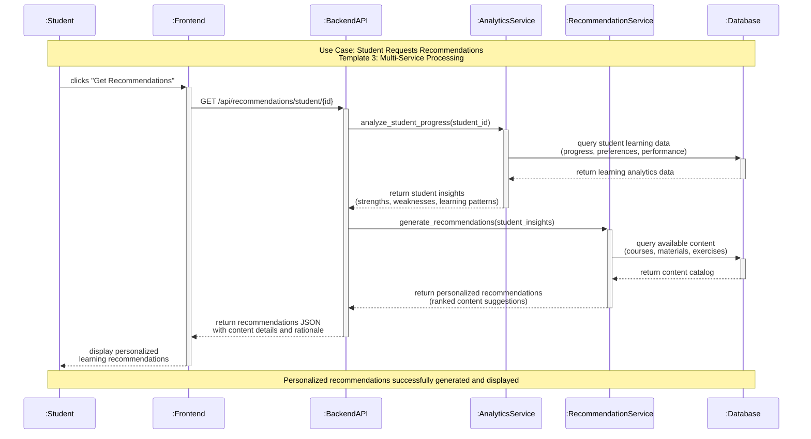

# AI-Powered Personalized Learning System
## Sequence Diagram: Student Requests Recommendations

```mermaid
sequenceDiagram
    participant Student as :Student
    participant Frontend as :Frontend
    participant BackendAPI as :BackendAPI
    participant AnalyticsService as :AnalyticsService
    participant RecommendationService as :RecommendationService
    participant Database as :Database

    Note over Student, Database: Use Case: Student Requests Recommendations<br/>Template 3: Multi-Service Processing

    %% Step 1: Student initiates request
    Student->>+Frontend: clicks "Get Recommendations"
    
    %% Step 2: Frontend calls backend
    Frontend->>+BackendAPI: GET /api/recommendations/student/{id}
    
    %% Step 3: Backend calls analytics service
    BackendAPI->>+AnalyticsService: analyze_student_progress(student_id)
    
    %% Step 4: Analytics queries database
    AnalyticsService->>+Database: query student learning data<br/>(progress, preferences, performance)
    
    %% Step 5: Database returns learning data
    Database-->>-AnalyticsService: return learning analytics data
    
    %% Step 6: Analytics processes and returns insights
    AnalyticsService-->>-BackendAPI: return student insights<br/>(strengths, weaknesses, learning patterns)
    
    %% Step 7: Backend calls recommendation service
    BackendAPI->>+RecommendationService: generate_recommendations(student_insights)
    
    %% Step 8: Recommendation service queries database
    RecommendationService->>+Database: query available content<br/>(courses, materials, exercises)
    
    %% Step 9: Database returns content data
    Database-->>-RecommendationService: return content catalog
    
    %% Step 10: Recommendation service generates recommendations
    RecommendationService-->>-BackendAPI: return personalized recommendations<br/>(ranked content suggestions)
    
    %% Step 11: Backend returns recommendations
    BackendAPI-->>-Frontend: return recommendations JSON<br/>with content details and rationale
    
    %% Step 12: Frontend displays recommendations
    Frontend-->>-Student: display personalized<br/>learning recommendations

    Note over Student, Database: Personalized recommendations successfully generated and displayed
```