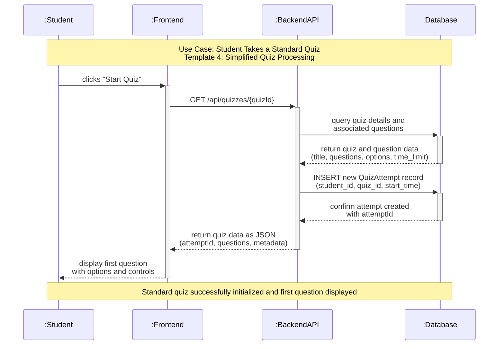

# AI-Powered Personalized Learning System
## Sequence Diagram: Student Takes a Standard Quiz

```mermaid
sequenceDiagram
    participant Student as :Student
    participant Frontend as :Frontend
    participant BackendAPI as :BackendAPI
    participant Database as :Database

    Note over Student, Database: Use Case: Student Takes a Standard Quiz<br/>Template 4: Simplified Quiz Processing

    %% Step 1: Student starts quiz
    Student->>+Frontend: clicks "Start Quiz"
    
    %% Step 2: Frontend requests quiz data
    Frontend->>+BackendAPI: GET /api/quizzes/{quizId}
    
    %% Step 3: Backend queries for quiz and questions
    BackendAPI->>+Database: query quiz details and<br/>associated questions
    
    %% Step 4: Database returns quiz data
    Database-->>-BackendAPI: return quiz and question data<br/>(title, questions, options, time_limit)
    
    %% Step 5: Backend creates quiz attempt
    BackendAPI->>+Database: INSERT new QuizAttempt record<br/>(student_id, quiz_id, start_time)
    Database-->>-BackendAPI: confirm attempt created<br/>with attemptId
    
    %% Step 6: Backend returns quiz data
    BackendAPI-->>-Frontend: return quiz data as JSON<br/>(attemptId, questions, metadata)
    
    %% Step 7: Frontend displays first question
    Frontend-->>-Student: display first question<br/>with options and controls

    Note over Student, Database: Standard quiz successfully initialized and first question displayed
```