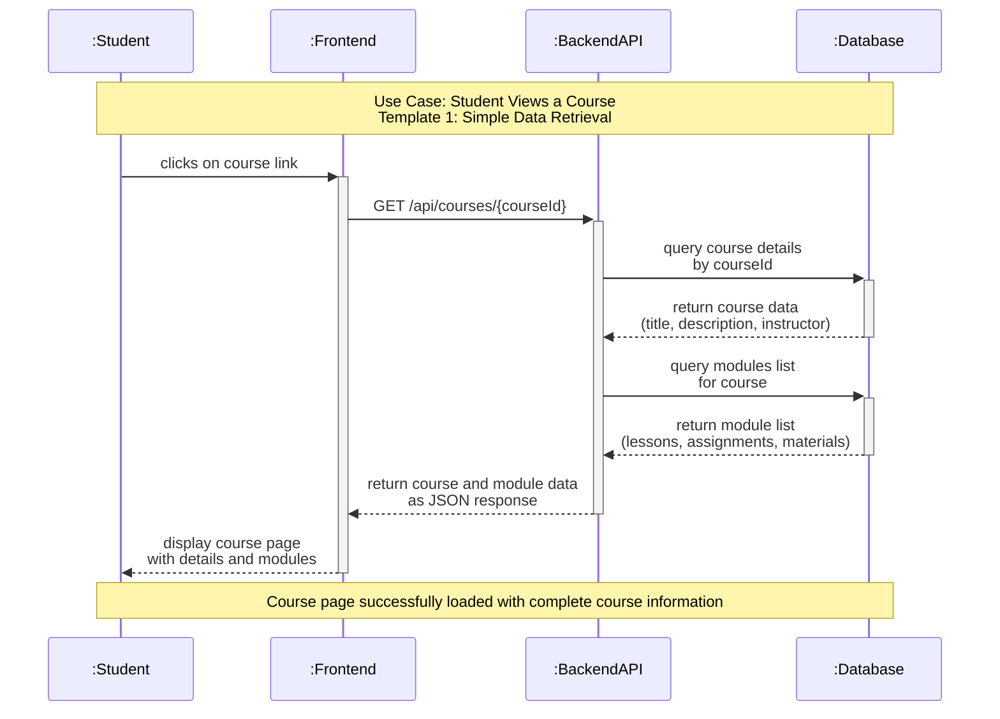

# AI-Powered Personalized Learning System
## Sequence Diagram: Student Views a Course

```mermaid
sequenceDiagram
    participant Student as :Student
    participant Frontend as :Frontend
    participant BackendAPI as :BackendAPI
    participant Database as :Database

    Note over Student, Database: Use Case: Student Views a Course<br/>Template 1: Simple Data Retrieval

    %% Step 1: Student clicks course link
    Student->>+Frontend: clicks on course link
    
    %% Step 2: Frontend requests course data
    Frontend->>+BackendAPI: GET /api/courses/{courseId}
    
    %% Step 3: Backend queries for course details
    BackendAPI->>+Database: query course details<br/>by courseId
    
    %% Step 4: Database returns course data
    Database-->>-BackendAPI: return course data<br/>(title, description, instructor)
    
    %% Step 5: Backend queries for course modules
    BackendAPI->>+Database: query modules list<br/>for course
    
    %% Step 6: Database returns module list
    Database-->>-BackendAPI: return module list<br/>(lessons, assignments, materials)
    
    %% Step 7: Backend returns aggregated data
    BackendAPI-->>-Frontend: return course and module data<br/>as JSON response
    
    %% Step 8: Frontend displays course page
    Frontend-->>-Student: display course page<br/>with details and modules

    Note over Student, Database: Course page successfully loaded with complete course information
```