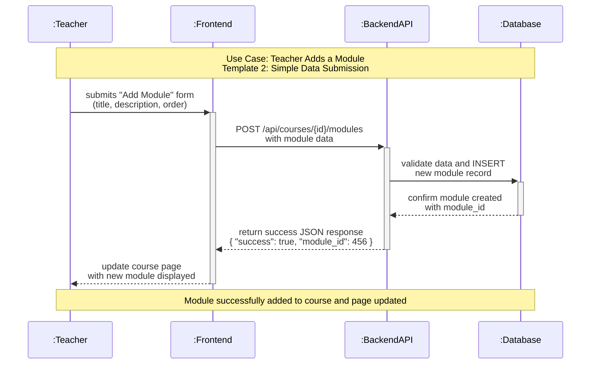

# AI-Powered Personalized Learning System
## Sequence Diagram: Teacher Adds a Module

```mermaid
sequenceDiagram
    participant Teacher as :Teacher
    participant Frontend as :Frontend
    participant BackendAPI as :BackendAPI
    participant Database as :Database

    Note over Teacher, Database: Use Case: Teacher Adds a Module<br/>Template 2: Simple Data Submission

    %% Step 1: Teacher submits form
    Teacher->>+Frontend: submits "Add Module" form<br/>(title, description, order)
    
    %% Step 2: Frontend sends module creation request
    Frontend->>+BackendAPI: POST /api/courses/{id}/modules<br/>with module data
    
    %% Step 3: Backend validates and creates module
    BackendAPI->>+Database: validate data and INSERT<br/>new module record
    
    %% Step 4: Database confirms creation
    Database-->>-BackendAPI: confirm module created<br/>with module_id
    
    %% Step 5: Backend returns success response
    BackendAPI-->>-Frontend: return success JSON response<br/>{ "success": true, "module_id": 456 }
    
    %% Step 6: Frontend updates course page
    Frontend-->>-Teacher: update course page<br/>with new module displayed

    Note over Teacher, Database: Module successfully added to course and page updated
```