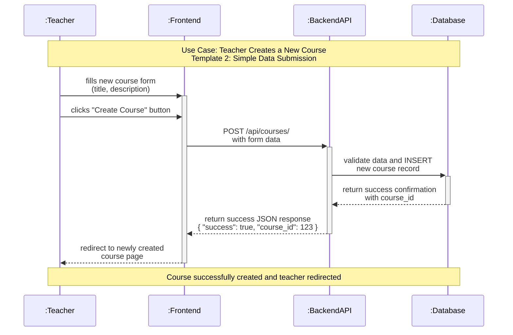

# AI-Powered Personalized Learning System
## Sequence Diagram: Teacher Creates a New Course

```mermaid
sequenceDiagram
    participant Teacher as :Teacher
    participant Frontend as :Frontend
    participant BackendAPI as :BackendAPI
    participant Database as :Database

    Note over Teacher, Database: Use Case: Teacher Creates a New Course<br/>Template 2: Simple Data Submission

    %% Step 1: Teacher fills form
    Teacher->>+Frontend: fills new course form<br/>(title, description)
    
    %% Step 2: Teacher submits form
    Teacher->>Frontend: clicks "Create Course" button
    
    %% Step 3: Frontend sends POST request
    Frontend->>+BackendAPI: POST /api/courses/<br/>with form data
    
    %% Step 4: Backend validates and inserts
    BackendAPI->>+Database: validate data and INSERT<br/>new course record
    
    %% Step 5: Database confirms creation
    Database-->>-BackendAPI: return success confirmation<br/>with course_id
    
    %% Step 6: Backend returns success response
    BackendAPI-->>-Frontend: return success JSON response<br/>{ "success": true, "course_id": 123 }
    
    %% Step 7: Frontend redirects teacher
    Frontend-->>-Teacher: redirect to newly created<br/>course page

    Note over Teacher, Database: Course successfully created and teacher redirected
```