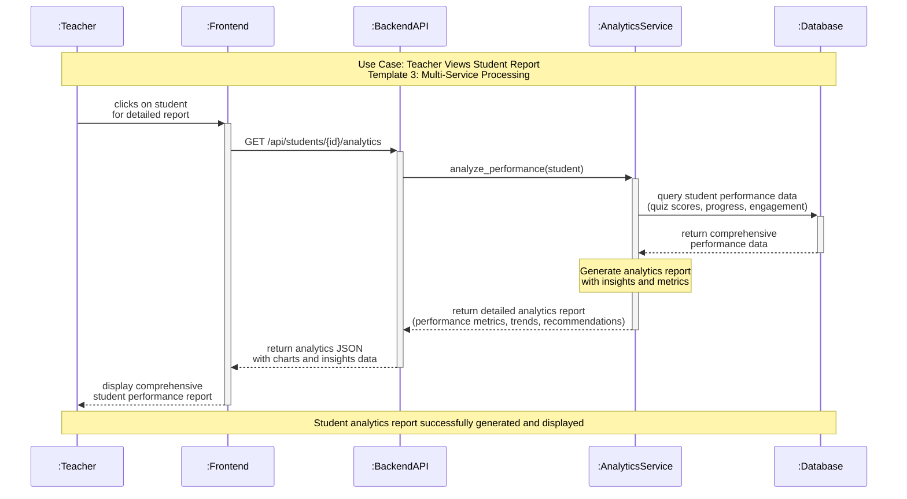

# AI-Powered Personalized Learning System
## Sequence Diagram: Teacher Views Student Report

```mermaid
sequenceDiagram
    participant Teacher as :Teacher
    participant Frontend as :Frontend
    participant BackendAPI as :BackendAPI
    participant AnalyticsService as :AnalyticsService
    participant Database as :Database

    Note over Teacher, Database: Use Case: Teacher Views Student Report<br/>Template 3: Multi-Service Processing

    %% Step 1: Teacher clicks on student
    Teacher->>+Frontend: clicks on student<br/>for detailed report
    
    %% Step 2: Frontend requests analytics
    Frontend->>+BackendAPI: GET /api/students/{id}/analytics
    
    %% Step 3: Backend calls analytics service
    BackendAPI->>+AnalyticsService: analyze_performance(student)
    
    %% Step 4: Analytics service gets student data
    AnalyticsService->>+Database: query student performance data<br/>(quiz scores, progress, engagement)
    
    %% Step 5: Database returns performance data
    Database-->>-AnalyticsService: return comprehensive<br/>performance data
    
    %% Step 6: Analytics service processes and returns report
    Note over AnalyticsService: Generate analytics report<br/>with insights and metrics
    AnalyticsService-->>-BackendAPI: return detailed analytics report<br/>(performance metrics, trends, recommendations)
    
    %% Step 7: Backend returns JSON response
    BackendAPI-->>-Frontend: return analytics JSON<br/>with charts and insights data
    
    %% Step 8: Frontend displays report
    Frontend-->>-Teacher: display comprehensive<br/>student performance report

    Note over Teacher, Database: Student analytics report successfully generated and displayed
```