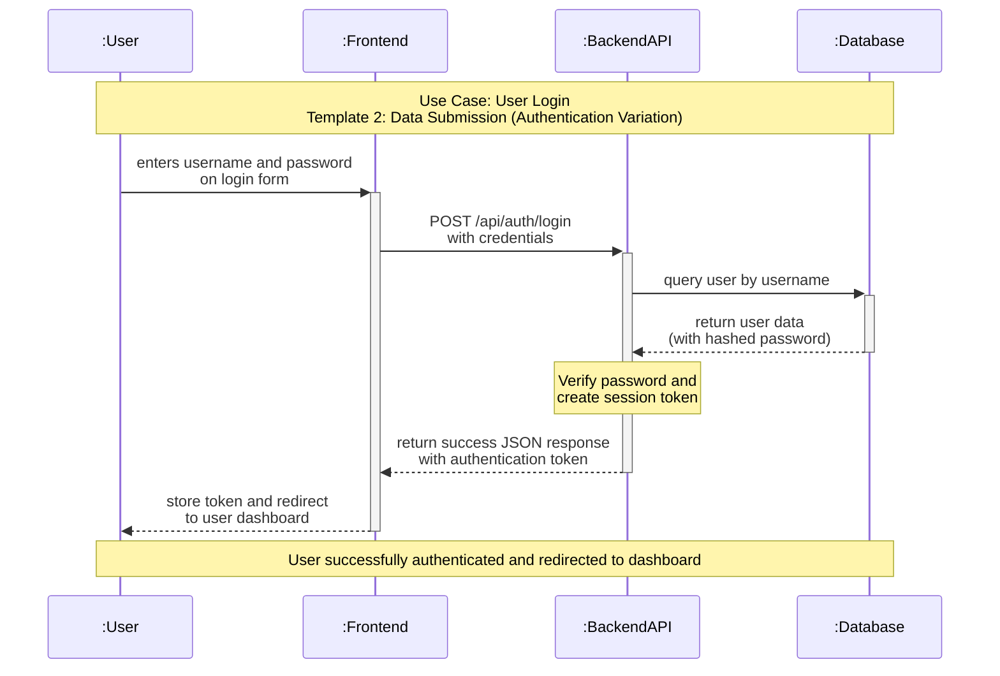

# AI-Powered Personalized Learning System
## Sequence Diagram: User Login

```mermaid
sequenceDiagram
    participant User as :User
    participant Frontend as :Frontend
    participant BackendAPI as :BackendAPI
    participant Database as :Database

    Note over User, Database: Use Case: User Login<br/>Template 2: Data Submission (Authentication Variation)

    %% Step 1: User enters credentials
    User->>+Frontend: enters username and password<br/>on login form
    
    %% Step 2: Frontend sends authentication request
    Frontend->>+BackendAPI: POST /api/auth/login<br/>with credentials
    
    %% Step 3: Backend queries for user
    BackendAPI->>+Database: query user by username
    
    %% Step 4: Database returns user data
    Database-->>-BackendAPI: return user data<br/>(with hashed password)
    
    %% Step 5: Backend verifies and creates token
    Note over BackendAPI: Verify password and<br/>create session token
    
    %% Step 6: Backend returns success response
    BackendAPI-->>-Frontend: return success JSON response<br/>with authentication token
    
    %% Step 7: Frontend stores token and redirects
    Frontend-->>-User: store token and redirect<br/>to user dashboard

    Note over User, Database: User successfully authenticated and redirected to dashboard
```